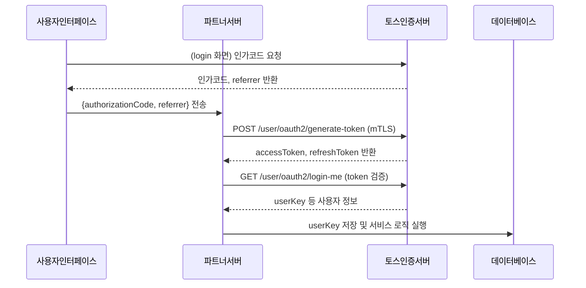
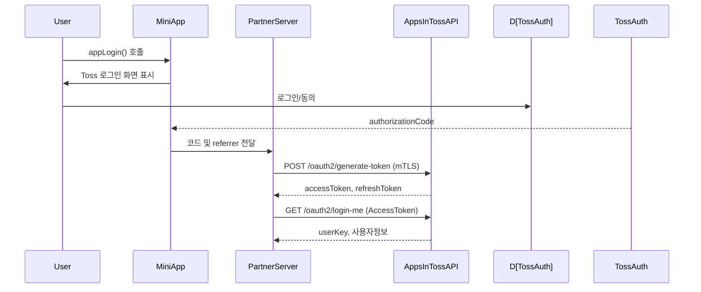

# 요약  
앱인토스 미니앱 연동을 위한 개발자는 안전한 **mTLS 기반 통신 환경**을 구축해야 합니다【10†L49-L57】. 파트너 서버는 콘솔에서 발급받은 클라이언트 인증서와 키를 사용하여 앱인토스 API에 HTTPS로 요청하고, 필요한 경우 사용자 인증(OAuth2) 및 고유 식별키(`x-toss-user-key`)를 활용합니다【23†L57-L65】【57†L262-L270】. 본 문서에서는 앱인토스 공식 개발자센터(한국어) 자료를 바탕으로, *인증 흐름*, *주요 API 엔드포인트*, *SDK 활용법*, *보안·버전관리·테스트 등 구현 가이드*를 포괄적으로 제공합니다. 주요 호출 예시(cURL, Node.js 등)와 Mermaid 다이어그램을 포함하고, 누락된 세부사항은 “미명시”로 명확히 표시했습니다.

## 목차  
- [1. 사전 준비](#1-사전-준비)  
- [2. 인증 및 토큰 관리](#2-인증-및-토큰-관리)  
- [3. API 엔드포인트 개요](#3-api-엔드포인트-개요)  
  - 3.1 [토스 로그인 (OAuth)](#31-토스-로그인-oauth)  
  - 3.2 [프로모션(토스 포인트)](#32-프로모션토스-포인트)  
  - 3.3 [토스 페이](#33-토스-페이)  
  - 3.4 [인앱 결제](#34-인앱-결제) (미명시)  
  - 3.5 [푸시/알림 (Messenger)](#35-푸시알림-messenger)  
- [4. SDK 사용 예시](#4-sdk-사용-예시)  
- [5. 콜백/웹훅 설정](#5-콜백웹훅-설정) (미명시)  
- [6. 에러 처리 및 재시도](#6-에러-처리-및-재시도)  
- [7. 버전관리 및 마이그레이션](#7-버전관리-및-마이그레이션)  
- [8. 보안 권장사항](#8-보안-권장사항)  
- [9. 테스트 및 샌드박스](#9-테스트-및-샌드박스)  
- [10. 배포/CI 체크리스트](#10-배포ci-체크리스트)  
- [11. 모니터링 및 로깅](#11-모니터링-및-로깅)  
- [다이어그램](#다이어그램)  
- [출시 준비 체크리스트](#출시-준비-체크리스트)  

## 1. 사전 준비  
- **앱 등록 & 인증서**: 앱인토스 콘솔에서 미니앱을 등록하고, **mTLS 서버 인증서**를 발급받아야 합니다【23†L77-L85】. 서버에 인증서와 키 파일을 안전하게 보관하고, 만료 전 재발급해야 합니다【23†L88-L97】. 인증서 탈취 시 즉시 폐기하고 재발급해야 합니다【24†L318-L324】.  
- **방화벽 설정**: 서버 간 통신을 위해 **수신(Inbound) 및 발신(Outbound) IP/포트**를 허용해야 합니다. 예를 들어 앱인토스 서버(`*.toss.im`)로 **TCP 443** 포트를 열고, SandBox 또는 Toss App 환경 등에서 오는 요청을 허용해야 합니다【10†L69-L77】. 허용하지 않을 경우 API 호출 또는 콜백 수신이 불가합니다.  
- **API 기본 정보**: 앱인토스 파트너서버 API의 기본 URL은 `https://apps-in-toss-api.toss.im`(결제 API는 `pay-apps-in-toss-api.toss.im`)입니다【43†L90-L94】【57†L238-L242】. 모든 요청은 HTTPS(mTLS)를 사용하며, 헤더 `Content-Type: application/json`을 포함해야 합니다.  
- **요청 속도 제한**: 기본 QPM(QPS) 제한은 **3,000 QPM**입니다. 초과 시 HTTP 429 응답이 반환될 수 있으며, 초당 호출수를 조절해야 합니다【10†L148-L156】.  
- **공통 응답 포맷**: 모든 API는 `{ "resultType": "SUCCESS"|"FAIL", ... }` 구조를 사용합니다【10†L110-L118】. 성공 시 `success` 필드에 결과 데이터가, 실패 시 `errorCode`/`reason` 등의 정보가 포함됩니다.

## 2. 인증 및 토큰 관리  

### 2.1 Toss 로그인 (OAuth2)  
앱인토스 미니앱에서 **토스 로그인**을 구현하려면 SDK의 `appLogin` 함수를 호출해 인가코드(`authorizationCode`)와 `referrer`를 획득합니다【43†L64-L73】【43†L77-L85】. 이후 파트너 서버에서 이 코드로 **AccessToken**을 발급받습니다.  



- **인가 코드(Authorization Code)**: SDK `appLogin` 호출 시 반환되는 값입니다【43†L64-L73】. 유효 기간은 10분이며, 중복 사용 시 재발급해야 합니다【43†L74-L81】.  
- **AccessToken 발급**: 서버에서 `POST /api-partner/v1/apps-in-toss/user/oauth2/generate-token` 엔드포인트를 호출합니다【43†L90-L98】. 요청 바디에 `{ "authorizationCode": "...", "referrer": "..." }`를 JSON으로 포함합니다【43†L99-L107】. 반환값으로 `accessToken`, `refreshToken`, `expiresIn`, `scope` 등이 제공됩니다【43†L113-L122】. 예시:  

    ```json
    {
      "resultType": "SUCCESS",
      "success": {
        "tokenType": "Bearer",
        "accessToken": "eyJraWQiOiJjZXJ0...",
        "refreshToken": "xNEYPASwWw0...",
        "expiresIn": 3599,
        "scope": "user_ci user_name user_phone ..."
      }
    }
    ```  
    토큰 발급 실패 시 `invalid_grant` 오류가 발생할 수 있습니다【43†L138-L146】.  

- **토큰 재발급(Refresh)**: AccessToken 만료 시 `{ "refreshToken": "..." }`를 `POST /user/oauth2/refresh`로 보내면 새 토큰을 받을 수 있습니다. (API 경로: `/api-partner/v1/apps-in-toss/user/oauth2/refresh-token`, 문서 미명시)  
- **사용자 정보 조회**: 발급된 AccessToken으로 `GET /api-partner/v1/apps-in-toss/user/oauth2/login-me`를 호출하여 토큰 소유자 정보를 가져옵니다【41†L195-L204】. 요청 헤더에 `Authorization: Bearer {accessToken}` 을 포함합니다. 응답으로 `userKey`, 동의 scope 목록, 암호화된 사용자 이름/전화/생년월일/CI/성별/국적/이메일 등이 반환됩니다【41†L211-L220】. 모든 개인정보는 AES-256-GCM으로 암호화되므로, 콘솔에서 발급받은 복호화키(AES Key)와 AAD 값으로 복호화해야 합니다【41†L279-L288】【41†L229-L237】. 예시 응답:  

    ```json
    {
      "resultType": "SUCCESS",
      "success": {
        "userKey": 443731104,
        "scope": "user_ci,user_birthday,user_name,...,user_key",
        "agreedTerms": ["terms_tag1", "terms_tag2"],
        "name": "ENCRYPTED_VALUE",
        "phone": "ENCRYPTED_VALUE",
        "birthday": "ENCRYPTED_VALUE",
        "ci": "ENCRYPTED_VALUE",
        "di": null,
        "gender": "ENCRYPTED_VALUE",
        "nationality": "ENCRYPTED_VALUE",
        "email": null
      }
    }
    ```  

    - **주의**: 2026년 1월 2일부터 `scope`에 자동으로 `user_key`가 추가될 예정이므로, 예외가 발생하지 않도록 처리해야 합니다【41†L199-L204】.  
    - 에러 예시: `{ "resultType":"FAIL", "error": { "errorCode":"INTERNAL_ERROR", "reason":"..." } }`【41†L267-L275】, 또는 `{"error":"invalid_grant"}` (토큰 오류)【41†L249-L256】.  

- **연결 끊기 (로그아웃)**: 발급받은 AccessToken을 폐기하려면 아래 두 API를 사용합니다【39†L400-L408】:  
  - `POST /api-partner/v1/apps-in-toss/user/oauth2/access/remove-by-access-token`: 요청 헤더에 `Authorization: Bearer {accessToken}`.  
  - `POST /api-partner/v1/apps-in-toss/user/oauth2/access/remove-by-user-key`: `x-toss-user-key: {userKey}` 헤더 포함.  
  *예시 (AccessToken 방식)*:  

    ```bash
    curl -X POST 'https://apps-in-toss-api.toss.im/api-partner/v1/apps-in-toss/user/oauth2/access/remove-by-access-token' \
      -H 'Content-Type: application/json' \
      -H "Authorization: Bearer $accessToken"
    ```【39†L412-L419】  
    UserKey 방식도 비슷하며, **읽기 제한 초과(Timeout)** 시에는 곧바로 재시도하지 말고 잠시 후 재시도해야 합니다【39†L438-L441】.  

### 2.2 기타 인증 토큰  
- **프로모션/메시징 API 인증**: 대부분의 파트너 호출(프로모션 포인트 지급, 메시지 전송 등)에는 **헤더 `x-toss-user-key: {userKey}`**가 필수입니다【57†L262-L270】. 이는 로그인으로 얻은 `userKey` 값입니다.  
- **API Key**: 앱인토스 개발자센터에 별도 API 키 개념은 없습니다. 모든 호출은 mTLS 인증과 OAuth/사용자 키 기반으로 인증합니다.  

## 3. API 엔드포인트 개요  
다음은 앱인토스가 제공하는 주요 REST API 엔드포인트입니다. HTTP 메서드, URL 경로, 주요 파라미터 및 응답 형식을 정리합니다. 필요한 경우 예시 JSON 또는 cURL 명령을 포함합니다.

### 3.1 토스 로그인 관련  
- **토큰 발급**:  
  - **URL**: `POST /api-partner/v1/apps-in-toss/user/oauth2/generate-token`【43†L90-L98】  
  - **파라미터(Body)**: `authorizationCode`, `referrer` (JSON)【43†L99-L107】  
  - **응답(성공)**: `accessToken`, `refreshToken`, `expiresIn`, `scope` (JSON)【43†L113-L122】.  
  - **예시 요청**: 위 [2.1](#21-toss-로그인-oauth) 참고.  
- **토큰 재발급**:  
  - **URL**: `POST /api-partner/v1/apps-in-toss/user/oauth2/refresh-token` (문서 미명시, API 구조 추정)  
  - **파라미터(Body)**: `refreshToken` (string).  
  - **응답**: 새로운 `accessToken`/`refreshToken` 등. (성공 시 `resultType: SUCCESS`)  
- **사용자 정보 조회**:  
  - **URL**: `GET /api-partner/v1/apps-in-toss/user/oauth2/login-me`【41†L195-L204】  
  - **헤더**: `Authorization: Bearer {accessToken}`  
  - **응답**: 암호화된 개인 정보와 `userKey`, 동의 `scope`, 약관 등 (JSON)【41†L211-L220】.  
- **연결 끊기 (로그아웃)**: 위 [2.1](#21-toss-로그인-oauth)에 정리된 `remove-by-access-token` 및 `remove-by-user-key` 호출.

> **팁**: cURL 예시—액세스 토큰으로 연결 끊기【39†L412-L419】:  
> ```bash
> curl -X POST 'https://apps-in-toss-api.toss.im/api-partner/v1/apps-in-toss/user/oauth2/access/remove-by-access-token' \
>   -H 'Content-Type: application/json' \
>   -H "Authorization: Bearer eyJraWQiOiJjZXJ0..."
> ```【39†L412-L419】  

### 3.2 프로모션 (토스 포인트)  
토스 포인트 프로모션 관련 서버-to-서버 API입니다【57†L232-L240】:  
- **1) 지급 Key 생성**: 파트너 서버에서 **POST /api-partner/v1/apps-in-toss/promotion/execute-promotion/get-key**를 호출하여 `key`를 발급받습니다【57†L252-L260】.  
  - **헤더**: `x-toss-user-key: {userKey}` (필수)【57†L262-L270】.  
  - **응답(성공)**: `{ resultType: "SUCCESS", success: { key: "..." } }` (발급된 key, Base64)【57†L271-L279】.  
- **2) 포인트 지급 실행**: 발급된 `key`로 **POST /api-partner/v1/apps-in-toss/promotion/execute-promotion** 호출【57†L282-L290】.  
  - **헤더**: `x-toss-user-key`【57†L290-L299】.  
  - **파라미터(Body)**: `{ promotionCode, key, amount }`.  
  - **응답**: `{ resultType: "SUCCESS", success: { key: "..." } }`【57†L310-L319】.  
- **3) 지급 결과 조회**: **POST /api-partner/v1/apps-in-toss/promotion/execution-result**로 상태를 확인【57†L322-L330】.  
  - **헤더**: `x-toss-user-key`【57†L330-L339】.  
  - **파라미터(Body)**: `{ promotionCode, key }`.  
  - **응답**: `{ resultType: "SUCCESS", success: "PENDING"|"SUCCESS"|"FAILED" }`【57†L348-L357】.  
- **에러 코드**: 자주 발생하는 프로모션 오류 예시: `4100`(프로모션 없음), `4109`(프로모션 미실행), `4112`(예산 부족), `4113`(중복 key) 등【57†L375-L383】. 각 에러 코드를 참고하여 예산 부족 등 적절히 대응해야 합니다. 예를 들어 `4109` 발생 시 콘솔에서 예산을 증액해야 합니다【57†L369-L374】.

### 3.3 토스 페이 (앱결제)  
앱인토스에서 Toss Payments 기능을 활용하려면 **Toss Payments Open API**를 사용해야 합니다. 주요 엔드포인트는 다음과 같습니다(앱인토스 콘솔에서 해당 기능 신청 필요).  
- **결제 생성**: `POST /api-partner/v1/apps-in-toss/pay/make-payment` – 주문 생성.  
- **결제 실행**: `POST /api-partner/v1/apps-in-toss/pay/execute-payment` – 사용자 인증 완료 후 결제 요청. (SDK 예: `TossPay.checkoutPayment`)【59†L69-L78】.  
- **결제 상태 조회**: `GET /api-partner/v1/apps-in-toss/pay/get-order-status` (또는 POST) – `payToken` 또는 `orderNo`로 조회.  
- **환불 요청**: `POST /api-partner/v1/apps-in-toss/pay/refund-payment` – 결제 환불 요청【68†L1-L3】.  

각 API는 `x-toss-user-key` 헤더를 요구할 수 있고, Toss Payments 플랫폼의 스키마(금액, 과세정보 등)에 따라 파라미터가 달라집니다. 자세한 사용법은 토스페이먼츠 개발자센터를 참고하세요(앱인토스는 Toss Payments API를 래핑합니다). 예: `{ amount, orderNo, payToken, paymentKey }` 형식의 JSON.

### 3.4 인앱 결제  
- **IAP 주문 상태 조회**: `GET /api-partner/v1/apps-in-toss/iap/get-order-status` (또는 `/order/get-order-status`) – 사용자 앱스토어 주문 ID로 상태 조회.  
  문서 미발견(미명시) 상태로, 필요한 파라미터(`orderId` 또는 `purchaseToken`)와 반환 형식은 콘솔 가이드 확인 및 테스트 필요합니다.  

### 3.5 푸시/알림 (Messenger)  
앱인토스 기반 푸시·알림 API입니다. `x-toss-user-key`와 사용자 동의 범위가 필요합니다【78†L31-L39】.  
- **테스트 메시지 발송**: `POST /api-partner/v1/apps-in-toss/messenger/send-test-message` – 번들 심사 전 연동 테스트용. 사용자 토큰 필요.  
- **단건 메시지 발송**: `POST /api-partner/v1/apps-in-toss/messenger/send-message` – 특정 유저에게 알림/메시지 전송【78†L31-L39】.  
- **대량 메시지 발송**: `POST /api-partner/v1/apps-in-toss/messenger/send-bulk-message` – 여러 사용자에게 동시 전송.  

각 API의 헤더: `x-toss-user-key`, `Content-Type: application/json` 등을 포함합니다. 예를 들어 단건 발송은 `{ "title": "...", "body": "...", "x": ... }` 형식의 JSON을 사용합니다. 더 자세한 파라미터는 앱인토스 콘솔 가이드 및 API 문서를 참조하세요.

## 4. SDK 사용 예시  
앱인토스는 React Native/WebView용 [Granite 기반 프레임워크](https://developers-apps-in-toss.toss.im/bedrock/reference/framework/시작하기/intro.md)를 제공합니다. 주요 활용 예시는 다음과 같습니다.  

- **초기화 및 설정**: `@apps-in-toss/framework`, `@apps-in-toss/web-framework` 패키지를 설치하고, 앱 식별자(Partnet App ID)를 설정한 뒤 사용합니다. (초기화 코드 예: `Toss.init({ clientId: "...", clientSecret: "..." })`, 문서 미명시)  
- **토스 로그인**: `appLogin()` 함수로 로그인 UI를 띄우고 인가코드를 받습니다【43†L64-L73】. 반환된 `authorizationCode`와 `referrer`를 서버에 전달하여 토큰 발급을 합니다.  
- **토스페이 결제**: SDK의 `checkoutPayment({ payToken })` 함수를 호출하면 토스 결제창이 실행됩니다【59†L69-L78】. 결제 인증 후 서버에서 별도 `/pay/execute-payment` 호출로 최종 결제합니다. 예시:  

  ```js
  import { checkoutPayment } from '@apps-in-toss/web-framework';
  const { success, reason } = await checkoutPayment({ payToken: "..." });
  if (success) {
    // 서버로 payToken 전송하여 결제 실행
  } else {
    console.error("인증 실패:", reason);
  }
  ```【59†L99-L108】  

- **프로모션 (비게임)**: `grantPromotionReward({ params: { promotionCode, amount } })` 함수로 즉시 포인트를 지급할 수 있습니다【55†L78-L86】. 사용법:  

  ```js
  const result = await grantPromotionReward({
    params: { promotionCode: "EVENT_2024", amount: 1000 }
  });
  if (result && 'key' in result) {
    console.log("포인트 지급 성공! Key=", result.key);
  }
  ```【55†L78-L86】  

- **기타 기능**: Granite 프레임워크를 통해 **광고, 공유, 설정** 등 다양한 모듈을 사용할 수 있습니다(예: 알림 권한 요청, 화면 이동, 메뉴바 설정 등). 자세한 내용은 SDK 레퍼런스 문서를 참고하세요.

## 5. 콜백/웹훅 설정  
앱인토스 자체적으로 웹훅(Callback) 엔드포인트는 명시된 바가 없습니다. (앱내 광고나 결제 후속처리 등에 대한 별도 비동기 알림은 **토스페이먼츠 웹훅**을 사용해야 할 수 있습니다.) 현재 문서에서는 관련 내용이 **미명시**되어 있으므로, 필요시 앱인토스에 문의하거나 외부 결제 서비스의 웹훅 가이드를 참고해야 합니다. 

## 6. 에러 처리 및 재시도  
- **응답 체크**: API 호출 응답의 `resultType`이 `"SUCCESS"`인지 확인하고, `"FAIL"`인 경우 `errorCode`를 검사합니다. OAuth 오류로 `"invalid_grant"` 등이 반환되면 토큰 만료 여부를 확인해야 합니다【43†L138-L146】【41†L249-L256】.  
- **토큰 만료**: AccessToken 만료 시 서버에서 refreshToken으로 재발급하거나, 필요시 사용자를 재로그인 처리해야 합니다.  
- **Idempotency**: 프로모션 지급처럼 같은 요청 재실행 시 중복 지급 오류(`4113`)가 발생할 수 있으므로, **동일 키 재사용을 방지**하고 필요한 경우 신규 키를 발급하여 재시도해야 합니다【57†L375-L383】.  
- **재시도 전략**: 5xx 서버 에러나 네트워크 타임아웃 시에는 **지수 백오프**를 적용합니다. 단, `연결 끊기(userKey)` API처럼 **읽기 제한 초과**(예: 3초 타임아웃) 오류 발생 시에는 곧바로 재시도하지 말고 일정 시간 경과 후 재시도해야 합니다【39†L438-L441】.  
- **로그 기록**: 에러 발생 시 전체 요청/응답을 로깅하되, 토큰이나 개인 정보는 마스킹해야 합니다. Sentry 등 오류 모니터링 도구를 활용하여 예외를 실시간 알람 처리하면 안정성 확보에 도움이 됩니다.  

## 7. 버전관리 및 마이그레이션  
- **API 버전**: 현재 앱인토스 API는 v1으로 제공되며, 엔드포인트 경로에 `v1`이 포함됩니다. 향후 버전 업데이트 시 점진적 마이그레이션을 고려해야 합니다.  
- **SDK 버전**: 앱인토스 SDK는 **1.x → 2.x** 마이그레이션이 필수입니다. RN 0.84 기반 업데이트 준비로 **2026년 3월 23일 이후 SDK 1.x로 빌드된 앱은 콘솔 업로드 불가**합니다【74†L48-L52】. 가능한 빨리 `@apps-in-toss/framework@2.x`, `web-framework@2.x`로 업데이트하세요【74†L84-L93】【74†L154-L162】.  
- **마이그레이션 주요 변경**【74†L84-L93】【74†L98-L107】: 빌드 명령 변경(`granite→ait`), React/React Native 버전 상승(React 18→19, RN 0.72→0.84 등)【74†L91-L99】, Granite 패키지 구조 변경 등. 자동 마이그레이션 스크립트(`ait migrate`)를 제공하므로 이를 활용합니다【74†L169-L177】.  
- **테스트 환경 분기**: SandBox 앱과 실제 토스 앱에서 반환되는 **`referrer` 값**이 다르므로(local sandbox에서는 `sandbox`, 실서비스에서는 `DEFAULT`) 이를 분기 처리해야 합니다【43†L70-L75】.  

## 8. 보안 권장사항  
- **mTLS 및 암호화**: 모든 API 호출은 mTLS로 암호화되므로, 서버의 인증서/키 파일은 안전한 저장소(Secrets Manager 등)에 관리하세요. 토큰과 개인정보(예: 사용자 이름/전화 등)는 가능한 암호화하여 저장합니다.  
- **인증서 관리**: 인증서 유출 시 즉시 폐기하고, 만료 1개월/1주일/1일 전 이메일 알림을 받을 수 있으므로 미리 재발급합니다【24†L326-L334】. 운영 중 두 개 이상의 인증서를 등록해 무중단 교체를 준비할 수 있습니다.  
- **스코프 최소화**: 로그인 시 앱인이스 콘솔에서 요청하는 사용자 정보 항목(scope)을 서비스 필수 항목으로 제한합니다. 불필요한 정보는 묻지 않도록 하고, 파트너 동의 화면에서 최소화된 범위만 요청하세요. 예: `user_ci`, `user_phone`, `user_name` 등 사용 사례에 맞는 범위만 포함합니다.  
- **SECRETS 관리**: `clientId`/`clientSecret`과 같은 민감 정보는 코드에 하드코딩하지 말고, 안전한 곳에 저장합니다. 로그에는 절대 노출하지 않도록 주의합니다.  
- **토큰 보호**: AccessToken/RefreshToken은 **서버간 통신용**이므로 클라이언트(앱) 노출을 금지합니다. 필요 시 HTTPS를 사용하여 안전하게 전송하고, 만료된 토큰은 즉시 폐기하세요.  

## 9. 테스트 및 샌드박스  
- **샌드박스 앱**: 콘솔에서 발급한 샌드박스 애플리케이션을 사용해 테스트합니다. 앞서 언급한 `referrer` 차이를 유의하며, 프로모션 등은 샌드박스 앱(Sandbox)에서 사전 테스트를 수행합니다. 프로모션은 **토스앱(QR 테스트)**에서 최소 1회 이상 호출하여 정상 동작을 확인해야 합니다【54†L72-L80】.  
- **테스트 시나리오**: 로그인, 결제, 프로모션, 메시징 등 모든 기능을 샌드박스 환경에서 검증하세요. 특히 JWT 토큰 처리, 사용자 정보 암호화/복호화, 네트워크 장애 시나리오(시간 초과, 인증 실패) 등을 시뮬레이션합니다.  
- **계약/심사 준비**: 토스 로그인을 포함한 결제·프로모션 기능 사용 전, 앱인이스 콘솔 및 토스 인증 부서(cert.support@toss.im)에서 필요한 설정(약관, 권한 리스트, redirect URI 등)을 완료해야 합니다【34†L99-L107】.  

## 10. 배포/CI 체크리스트  
- [ ] **인증서 관리**: mTLS 인증서를 CI/CD 환경에서 안전하게 주입하고, 키 파일을 암호화된 형태로 처리합니다.  
- [ ] **환경 구성**: 개발/스테이징/운영 환경에 맞는 API 엔드포인트, 리디렉션 URI, 웹훅 URL 등을 설정합니다.  
- [ ] **비밀 키 관리**: `clientSecret`, **RefreshToken** 등 민감 정보를 환경 변수나 시크릿 관리 시스템에 저장하고, 코드에는 포함하지 않습니다.  
- [ ] **자동화 테스트**: 통합 테스트 파이프라인에서 Sandbox를 활용해 토스 로그인·결제·프로모션 시나리오를 검증합니다.  
- [ ] **배포 전 프로모션 승인**: 프로모션 코드를 사용하여 실제 지급이 콘솔에서 승인 상태로 전환되는지 확인합니다.  
- [ ] **SDK 버전 최신화**: SDK 2.x와 라이브러리 최신 버전을 사용 중인지 확인합니다.  
- [ ] **로깅/모니터링 설정**: 에러 모니터링(Sentry 등) 및 로그 수집이 활성화되어 있는지 점검합니다.  

## 11. 모니터링 및 로깅  
- **메트릭 수집**: API 호출 수, 성공/실패 비율, 평균 응답 시간 등을 모니터링합니다. 특히 인증 오류, HTTP 5xx 비율, 예산 부족(프로모션)과 같은 주요 이벤트를 수집합니다.  
- **로그 레벨**: 개발 중에는 디버그/정보 레벨 로그를 활성화하고, 운영에서는 최소한의 경고/오류 수준으로 설정합니다. 민감 정보(토큰, 개인 데이터)는 로그에 남기지 않습니다.  
- **오류 알림**: 비정상 동작(예: API 500 에러, 인증 실패 등)은 즉시 알림(Alert)으로 전환합니다. Sentry, CloudWatch, Slack 연동 등을 통해 실시간 대응이 가능하도록 합니다.  

## 다이어그램  

```mermaid
flowchart TD
    subgraph 사용자 디바이스 
      A[미니앱(WebView/React Native)] -- AppLogin 호출 --> B(Toss 로그인 UI)
      A -- WebView API 호출 --> C[파트너 서버 (mTLS)]
    end
    subgraph 파트너 서버
      C -- OAuth2 토큰 교환 --> TossAPI[앱인토스 API 서버]
      C -- 프로모션API 호출 --> TossAPI
      C -- Push 메시지 --> TossAPI
    end
    subgraph Toss 인프라
      B -- 인증,동의 처리 --> D[Toss 인증서버]
      TossAPI -- 내부처리 --> D
    end
    TossAPI --> E[Toss Payments API] 
```



## 출시 준비 체크리스트  
- [ ] **mTLS 통신 점검**: 발급된 인증서로 모든 API가 정상 호출되는지 테스트(credential mis-match 확인)【23†L57-L65】.  
- [ ] **토큰 발급/로그인 검증**: `authorizationCode`→`AccessToken`→`login-me` 과정이 오류 없이 수행되는지 확인【43†L113-L122】【41†L211-L220】.  
- [ ] **프로모션 플로우 검증**: key 발급→지급→결과 조회 과정에서 예산 차감 및 오류 케이스를 점검【57†L273-L282】【57†L324-L331】.  
- [ ] **결제/환불 시나리오**: Toss Payments API 연동(주문 생성·실행·조회·환불)이 정상 동작하는지, 금액/과세 계산이 일치하는지 확인.  
- [ ] **에러 및 재시도 로직**: 네트워크 오류, 토큰 만료, 예산 부족 등 예외 상황에 대한 처리 및 재시도 로직이 구현되었는지 검증.  
- [ ] **버전 호환성**: 최신 SDK(2.x) 및 호환되는 React/React Native 버전으로 빌드되었는지 확인【74†L48-L52】.  
- [ ] **모니터링 활성화**: 오류 로그, Sentry 알람, 사용자 지표 등이 배포 전 설정되어 있는지 최종 점검.  

**추가 자료**: 앱인토스 개발자센터 문서 전체(한국어)와 Toss Payments 개발자센터(결제 API) 자료를 참조하세요. 각 API 세부 명세는 공식 문서를 확인하시기 바랍니다【10†L49-L57】【57†L262-L270】.